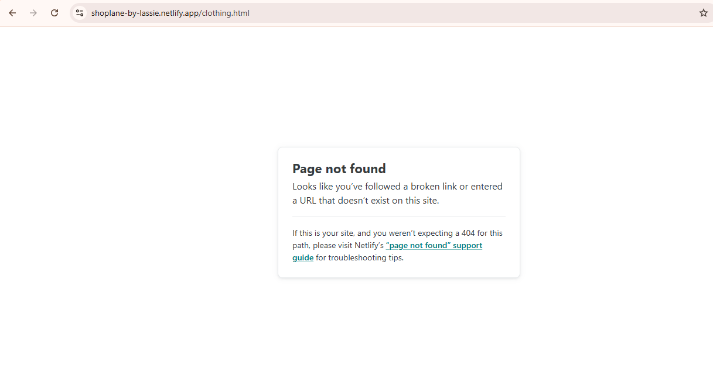
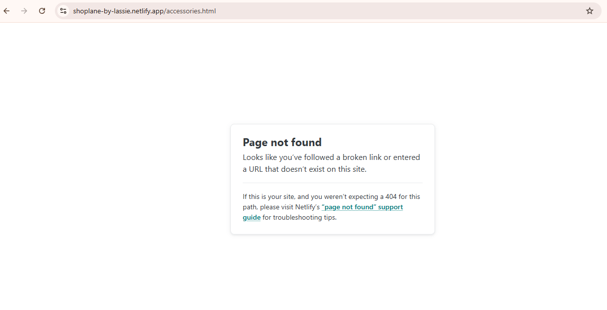
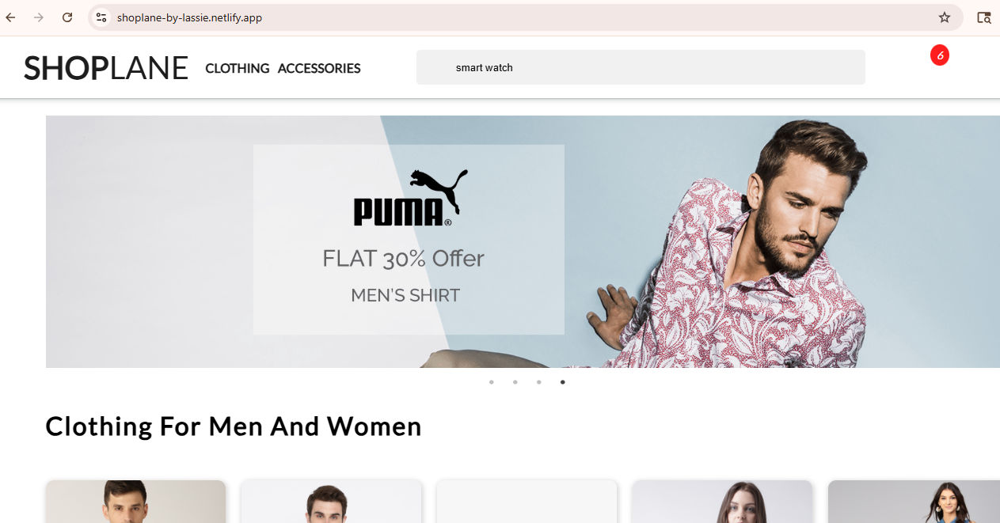
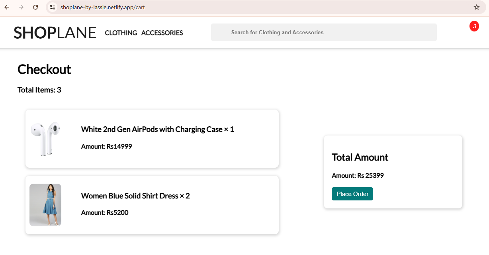
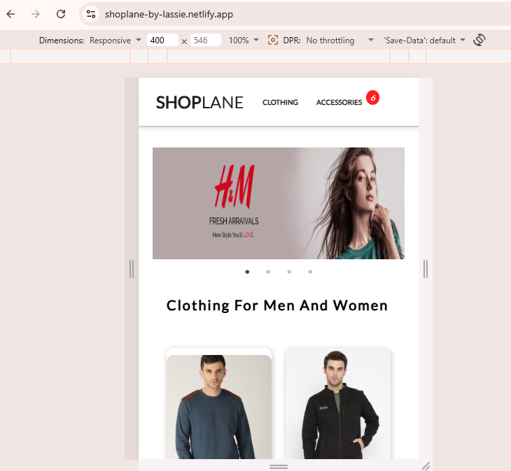
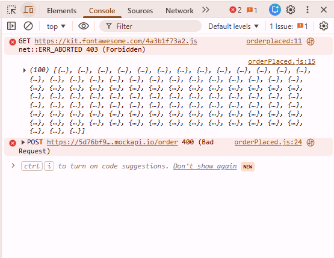

# Task-02 Compatibility Testing Report

## Objective

The objective of this task is to perform compatibility testing on a basic e-commerce website across different browsers and devices. The testing process includes checking navigation, responsiveness, functionality, broken links, console errors, and user interface behavior.

---

# Website Tested

https://shoplane-by-lassie.netlify.app/

---

# Browsers Tested

- Google Chrome

---

# Devices Tested

- Desktop
- Mobile

---

# Testing Areas

The following testing areas were covered:

1. Homepage Loading
2. Navigation Testing
3. Search Functionality
4. Cart Functionality
5. Product Card Testing
6. Mobile Responsiveness
7. Console Error Testing

---

# Test Cases and Results

| Test Case | Expected Result | Actual Result | Status |
|---|---|---|---|
| Homepage Loading | Website should load correctly | Website loaded successfully | Pass |
| Product Cards | Product pages should open correctly | Product pages opened properly | Pass |
| Add to Cart | Products should add to cart successfully | Products added successfully | Pass |
| Total Price Update | Total amount should update correctly | Total amount updated correctly | Pass |
| Clothing Navigation | Clothing page should open correctly | 404 Page Not Found error displayed | Fail |
| Accessories Navigation | Accessories page should open correctly | 404 Page Not Found error displayed | Fail |
| Search Functionality | Relevant products should appear | No products displayed after searching | Fail |
| Cart Quantity Controls | Users should modify quantity directly in cart | Quantity changes only by re-adding products | Improvement Suggested |
| Add to Cart Notification | Success message should appear | No confirmation message displayed | Improvement Suggested |
| Mobile Search Bar Visibility | Search bar should display properly | Search bar partially hidden on mobile | Fail |
| Console Error Testing | No console errors should appear | 400 and 403 errors detected | Fail |

---

# Issues Found

## 1. Broken Clothing and Accessories Navigation Links

### Description
The Clothing and Accessories navigation menus do not open the correct pages.

### Expected Result
Both Clothing and Accessories pages should open successfully.

### Actual Result
- Clothing navigation redirects to a 404 Page Not Found error.
- Accessories navigation also redirects to a 404 Page Not Found error.

### Severity
Medium

---

## 2. Search Functionality Issue

### Description
The search bar does not display matching products.

### Expected Result
Relevant products should appear when users search.

### Actual Result
No products are displayed when users search for products using the search bar.

### Severity
High

---

## 3. Limited Cart Quantity Control

### Description
Product quantity increases only when the same product is added multiple times from the product page. The cart page itself does not provide direct quantity increase or decrease controls.

### Expected Result
Users should be able to directly modify quantity from the cart page using increment/decrement controls.

### Actual Result
Quantity updates only by re-adding products from product cards.

### Severity
Low

### Status
Improvement Suggested

---

## 4. Missing Add-to-Cart Confirmation Message

### Description
After clicking the "Add to Cart" button, no confirmation or success message is displayed to the user.

### Expected Result
A confirmation message such as "Product added successfully" should appear.

### Actual Result
Product is added to the cart, but no visual confirmation message is shown.

### Severity
Low

### Status
Improvement Suggested

---

## 5. Mobile Responsiveness Issue

### Description
The search bar is partially hidden on smaller screen sizes.

### Expected Result
Search bar should be fully visible and properly aligned on mobile devices.

### Actual Result
Search bar alignment issue observed on smaller screens.

### Severity
Medium

---

## 6. Console Errors

### Description
Console displays failed API and resource loading errors.

### Errors Observed
- Failed to load resource (403 Forbidden)
- Failed to load resource (400 Bad Request)

### Expected Result
No console errors should appear during website usage.

### Actual Result
Multiple API request and resource loading failures were detected.

### Severity
Medium

---

# Screenshots

## Broken Clothing and Accessories Navigation

---

## Search Functionality Issue

---

## Cart Page

---

## Mobile Responsiveness Issue

---

## Console Errors

---

# Recommendations

- Fix broken navigation links
- Implement proper search functionality
- Add direct quantity controls in cart page
- Display success notifications after adding products to cart
- Improve mobile responsiveness using media queries
- Resolve API and resource loading issues
- Improve overall user experience and navigation handling

---

# Conclusion

The website was successfully tested on Google Chrome across desktop and mobile devices for compatibility and functionality. Multiple functional and responsiveness issues were identified during testing, including broken navigation links, search functionality problems, mobile responsiveness issues, and console errors. The website performs basic e-commerce operations successfully, such as product viewing and cart management, but improvements are recommended to enhance user experience, responsiveness, and application stability.
